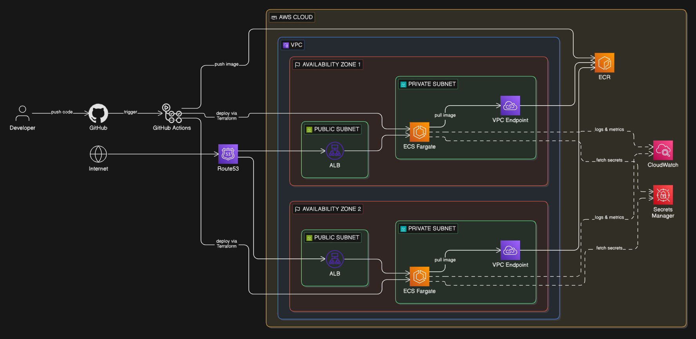

# ecs-launchpad
ECS Launchpad is a Platform Engineering project demonstrating end-to-end cloud infrastructure on AWS. It gives developers a platform to automate containerized application deployments with full observability.

My goal for this project is to apply the knowledge gained from my Platform Engineering internship and my time studying for the AWS Certified Solutions Architect Associate exam towards a real-world internal development platform. 



## Key Design Decisions
- **ECS Fargate**: serverless container runtime, removes the need to manage servers and simplifies scaling
- **ALB**: provides HTTPS load balancing, simplifies certificate management, and enables health-based routing
- **Modular Terraform**: infrastructure is separated into focused, reusable modules per concern, making infrastructure easier to maintain and extend
- **Multi-stage Docker build**: drastically reduces image size, separates build dependencies from the runtime image, and reduces attack surface
- **Separated IAM roles**: task execution role and task role are decoupled. The execution role handles ECS startup concerns, the task role governs what the running application can access at runtime
- **CloudWatch Container Insights**: monitors CPU and memory at the task and service level using native AWS tooling
- **OIDC Federation**: GitHub Actions assumes a scoped IAM role via short-lived token, removing the need to store credentials

## Tech Stack

| Layer | Technology |
|---|---|
| Application | Python 3.12, FastAPI |
| Containerization | Docker (multi-stage build) |
| Orchestration | AWS ECS Fargate |
| Container Registry | AWS ECR |
| Infrastructure-as-Code | Terraform |
| CI/CD | GitHub Actions |
| Networking | AWS VPC, ALB, IGW, VPC Endpoints, Security Groups |
| Observability | CloudWatch Logs, Metrics, Alarms, Dashboard |
| Security | AWS Secrets Manager, AWS IAM |

## Getting Started
### Prerequisites
- AWS CLI configured with appropriate permissions
- Terraform >= 1.14.8
- Docker
- GitHub repository with the following variables set:
  - `AWS_ROLE_ARN`
  - `AWS_REGION`

## Deployment 
### 1. Bootstrap Remote State (one time setup)

Before deploying any infrastructure, you need to provision the S3 bucket 
and DynamoDB table used for Terraform remote state.

```bash
cd terraform/bootstrap
cp terraform.tfvars.example terraform.tfvars  # edit values if needed
terraform init
terraform plan -out=tfplan
terraform apply tfplan
```

The `backend_config` output will be needed to configure the remote backend for the infrastructure modules.

## Roadmap

### Planning stage
- [x] Architecture design and README
### Application 
- [x] FastAPI application
- [x] Dockerfile
### Core Infrastructure
- [x] Terraform bootstrap module
- [x] Terraform VPC module
- [x] Terraform VPC Endpoints module
- [x] Terraform ECR module
- [x] Terraform IAM module
- [ ] Terraform ALB module
- [ ] Terraform ECS module
- [ ] Terraform CloudWatch module
### CI/CD
- [ ] GitHub Actions CI/CD Pipeline
### Deployment
- [ ] Live deployment

## Future Improvements
- [ ] Migrate to EKS for Kubernetes-native orchestration  
- [ ] Add an RDS module for persistent storage
- [ ] Add auto-scaling policies based on ALB request count
- [ ] Implement AWS WAF on the ALB for basic DDoS protection
- [ ] Add SNS notifications for CloudWatch alarms
- [ ] Blue/green deployments with CodeDeploy
- [ ] VPC Flow Logs for network traffic auditing